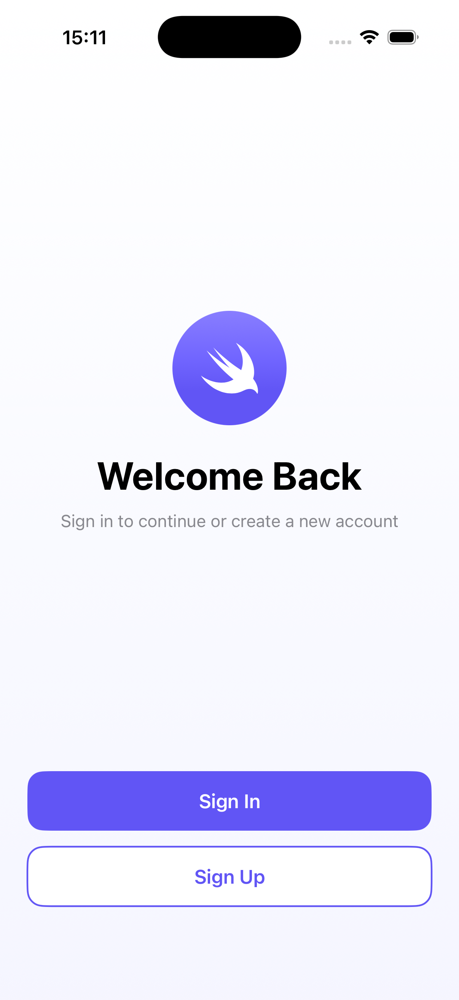
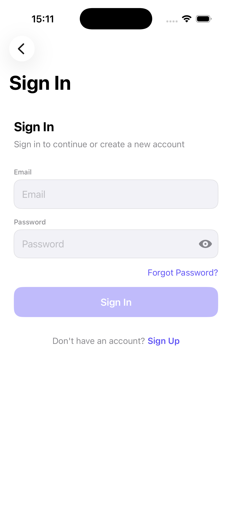
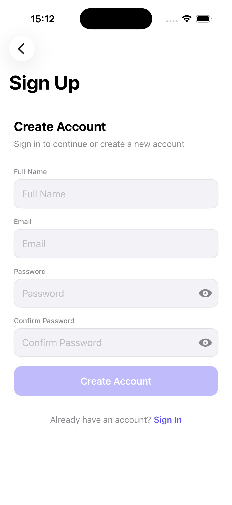
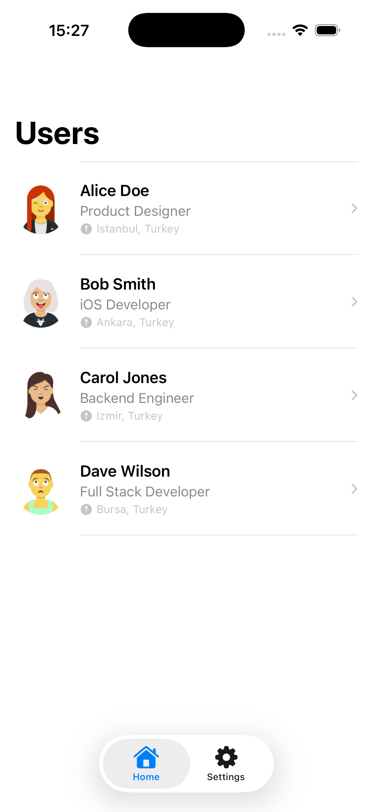
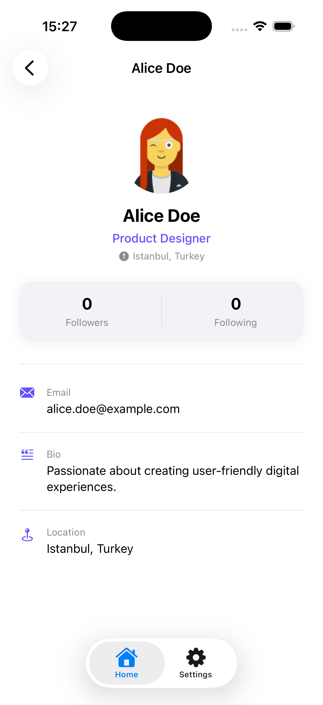
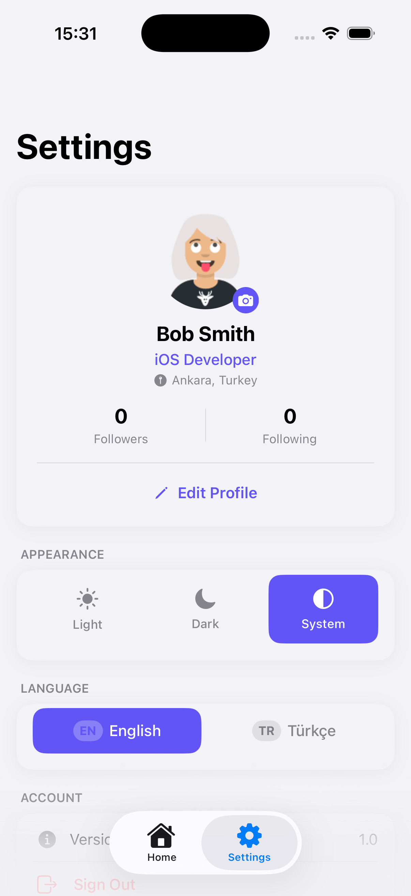
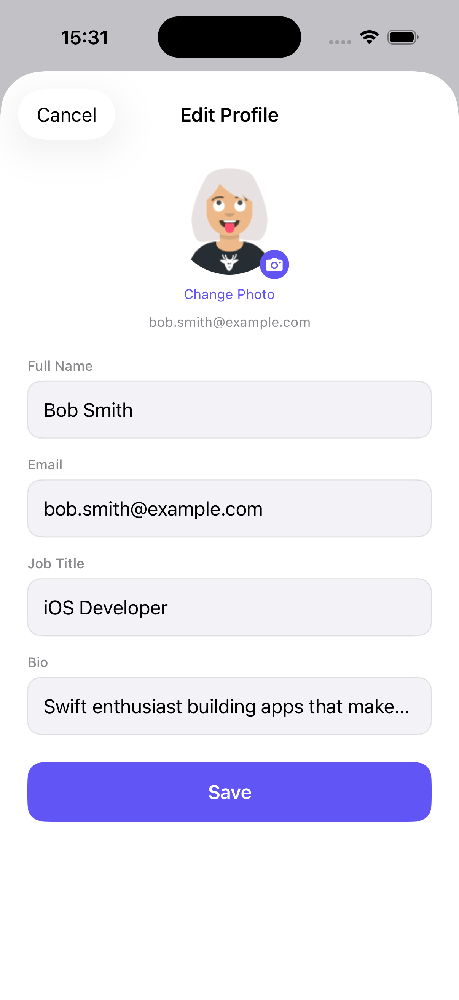
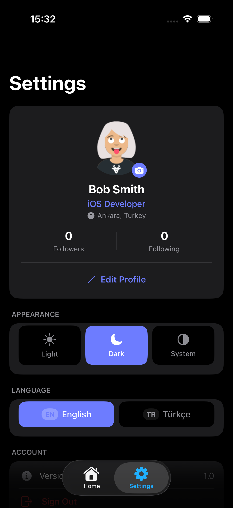

# SwiftUI Boilerplate

A production-ready SwiftUI boilerplate with **Clean Architecture**, **Supabase** backend integration, full **authentication flow**, **theme switching**, and **bilingual (EN/TR) localization** — built for iOS 17.5+.

---

## Screenshots

> _Replace the placeholders below with your actual screenshots._

| Welcome                             | Sign In                           |
| ----------------------------------- | --------------------------------- |
|  |  |

| Sign Up                           | Home                          | User Detail                       |
| --------------------------------- | ----------------------------- | --------------------------------- |
|  |  |  |

| Settings                              | Edit Profile                          | Dark Mode                          |
| ------------------------------------- | ------------------------------------- | ---------------------------------- |
|  |  |  |

---

## Features

- **Authentication** — Sign in, sign up, forgot password (Supabase Auth)
- **Session persistence** — Cache-first restore via Keychain; silent background token refresh
- **Profile management** — Edit name, bio, job title, location, avatar upload
- **User list** — Paginated list with detail view
- **Theme switching** — Light / Dark / System with instant preview
- **Localization** — English and Turkish, switchable at runtime
- **Splash screen** — Animated launch screen with loading dots
- **Clean Architecture** — Domain, Data, Presentation layers fully separated
- **Dependency injection** — Environment-based `AppContainer`
- **Unit tests** — Mock repositories, DTO encoding tests, error-path tests

---

## Architecture

The project follows **Clean Architecture** with an **MVVM** presentation pattern.

```
┌─────────────────────────────────────────────────┐
│                  Presentation                   │
│         Views (SwiftUI) + ViewModels            │
│              (@Observable MVVM)                 │
├─────────────────────────────────────────────────┤
│                    Domain                       │
│        Entities · Use Cases · Protocols         │
├─────────────────────────────────────────────────┤
│                     Data                        │
│     Repositories · DataSource · DTOs            │
├─────────────────────────────────────────────────┤
│                     Core                        │
│   DI · Navigation · Theme · Cache · Services    │
└─────────────────────────────────────────────────┘
```

### Data flow

```
View  →  ViewModel  →  UseCase  →  Repository (Protocol)
                                        ↓
                                  DataSource (Supabase)
```

---

## File Structure

```
swiftui_boilerplate/
│
├── Core/
│   ├── Cache/
│   │   └── UserCache.swift               # Keychain-based session cache
│   ├── Config/
│   │   └── SupabaseConfig.swift          # URL & anon key (from .xcconfig)
│   ├── DI/
│   │   └── AppContainer.swift            # Dependency injection container
│   ├── Extensions/
│   │   ├── Color+Extensions.swift        # Semantic color palette
│   │   ├── String+Extensions.swift       # Validation helpers
│   │   └── View+Extensions.swift         # UI utility modifiers
│   ├── Localization/
│   │   ├── LocalizationManager.swift     # Runtime language switching
│   │   └── Strings.swift                 # Localization key enum
│   ├── Navigation/
│   │   ├── AppRouter.swift               # NavigationStack path manager
│   │   └── Route.swift                   # AuthRoute / HomeRoute enums
│   ├── Services/
│   │   └── SupabaseService.swift         # Supabase client singleton
│   └── Theme/
│       └── ThemeManager.swift            # Light / Dark / System theme
│
├── Data/
│   ├── DataSources/
│   │   └── SupabaseDataSource.swift      # All Supabase API calls
│   ├── DTOs/
│   │   └── SupabaseProfileDTO.swift      # Codable profile model
│   └── Repositories/
│       ├── SupabaseAuthRepository.swift
│       └── SupabaseUserRepository.swift
│
├── Domain/
│   ├── Entities/
│   │   ├── AppError.swift                # Typed error model
│   │   └── User.swift                    # Core user entity
│   ├── Repositories/
│   │   ├── AuthRepositoryProtocol.swift
│   │   └── UserRepositoryProtocol.swift
│   └── UseCases/
│       ├── FetchUsersUseCase.swift
│       ├── ForgotPasswordUseCase.swift
│       ├── SignInUseCase.swift
│       ├── SignUpUseCase.swift
│       └── UpdateProfileUseCase.swift
│
├── Presentation/
│   ├── Auth/
│   │   ├── AuthFlowView.swift
│   │   ├── ForgotPassword/
│   │   ├── SignIn/
│   │   ├── SignUp/
│   │   └── Welcome/
│   ├── Components/
│   │   ├── AppTextField.swift
│   │   ├── LoadingOverlay.swift
│   │   ├── PrimaryButton.swift
│   │   ├── SecondaryButton.swift
│   │   └── UserAvatarView.swift
│   ├── Launch/
│   │   └── LaunchView.swift              # Animated splash screen
│   └── Main/
│       ├── Home/
│       ├── MainTabView.swift
│       └── Settings/
│
├── en.lproj/                             # English strings
├── tr.lproj/                             # Turkish strings
└── swiftui_boilerplateApp.swift          # @main entry point
```

---

## Tech Stack

| Category         | Technology                             |
| ---------------- | -------------------------------------- |
| Language         | Swift 6                                |
| UI Framework     | SwiftUI                                |
| State Management | `@Observable` (Observation framework)  |
| Backend          | [Supabase](https://supabase.com)       |
| Auth             | Supabase Auth                          |
| Database         | Supabase PostgREST                     |
| Storage          | Supabase Storage (avatar uploads)      |
| Session Cache    | Keychain (`Security` framework)        |
| Navigation       | `NavigationStack` + path-based routing |
| Localization     | Custom `LocalizationManager` (EN / TR) |
| Minimum iOS      | 17.5                                   |

---

## Prerequisites

- Xcode 16+
- iOS 17.5+ device or simulator
- A [Supabase](https://supabase.com) project

---

## Supabase Setup

### 1. Create the `profiles` table

Run this in the Supabase SQL editor:

```sql
create table public.profiles (
  id          uuid primary key references auth.users on delete cascade,
  full_name   text,
  username    text unique,
  email       text,
  avatar_url  text,
  job_title   text,
  location    text,
  bio         text,
  followers_count integer default 0,
  following_count integer default 0
);

-- Auto-create a profile row when a user signs up
create or replace function public.handle_new_user()
returns trigger as $$
begin
  insert into public.profiles (id, full_name, email)
  values (
    new.id,
    new.raw_user_meta_data->>'full_name',
    new.email
  );
  return new;
end;
$$ language plpgsql security definer;

create trigger on_auth_user_created
  after insert on auth.users
  for each row execute procedure public.handle_new_user();
```

### 2. Create the `avatars` storage bucket

```sql
insert into storage.buckets (id, name, public)
values ('avatars', 'avatars', true);

-- Allow authenticated users to upload their own avatar
create policy "Users can upload own avatar"
  on storage.objects for insert
  to authenticated
  with check (bucket_id = 'avatars' and auth.uid()::text = (storage.foldername(name))[1]);

create policy "Avatar images are publicly accessible"
  on storage.objects for select
  to public
  using (bucket_id = 'avatars');
```

### 3. Enable Row Level Security (optional but recommended)

```sql
alter table public.profiles enable row level security;

create policy "Profiles are viewable by authenticated users"
  on public.profiles for select
  to authenticated using (true);

create policy "Users can update own profile"
  on public.profiles for update
  to authenticated using (auth.uid() = id);
```

---

## Installation

### 1. Clone the repository

```bash
git clone https://github.com/yourusername/swiftui-boilerplate.git
cd swiftui-boilerplate
```

### 2. Add your Supabase credentials

Create a `Secrets.xcconfig` file in the project root (it is already in `.gitignore`):

```
SUPABASE_URL = https://your-project-ref.supabase.co
SUPABASE_ANON_KEY = your-anon-key
```

Or update `Core/Config/SupabaseConfig.swift` directly:

```swift
enum SupabaseConfig {
    static let projectURL = "https://your-project-ref.supabase.co"
    static let anonKey    = "your-anon-key"
}
```

### 3. Add Supabase Swift SDK via SPM

In Xcode:

1. **File → Add Package Dependencies...**
2. Enter the URL: `https://github.com/supabase/supabase-swift`
3. Set the version rule to **Up to Next Major** from `2.0.0`
4. Add the **Supabase** product to your target

### 4. Open and run

```bash
open swiftui_boilerplate.xcodeproj
```

Select your target device/simulator and press **⌘R**.

---

## Customization

### Branding colors

Edit `Core/Extensions/Color+Extensions.swift`:

```swift
extension Color {
    static let appPrimary   = Color.indigo  // ← change to your brand color
    static let appSecondary = Color.purple
}
```

### App name & copy

Update localization strings in `en.lproj/Localizable.strings` and `tr.lproj/Localizable.strings`. All UI text is driven through `LocalizationKey` enum in `Core/Localization/Strings.swift`.

### Adding a new screen

1. Create `Presentation/YourFeature/YourView.swift` and `YourViewModel.swift`
2. Add a route case to `Core/Navigation/Route.swift`
3. Handle navigation in `AppRouter`

---

## Running Tests

```bash
⌘U   # Run all tests in Xcode
```

Tests live in `swiftui_boilerplateTests/`. They use lightweight mock repositories (`MockAuthRepository`, `MockUserRepository`) and do not require a live Supabase connection.

**Covered cases:**

- DTO encoding (only editable fields are sent to API)
- Profile update with optional field clearing
- Sign-out routing when the repository throws an error

---

## Project Conventions

| Convention           | Detail                                                                          |
| -------------------- | ------------------------------------------------------------------------------- |
| State management     | `@Observable` — no `ObservableObject` / `@StateObject`                          |
| ViewModels           | Instantiated by parent views; passed down as dependencies                       |
| Error handling       | `AppError` typed enum; localized messages via `LocalizationManager`             |
| Async                | `async/await` throughout; no Combine                                            |
| Dependency injection | `AppContainer` via SwiftUI `Environment`                                        |
| Navigation           | `NavigationStack` with `[Route]` path arrays; no `NavigationLink(destination:)` |

---

## License

MIT License. See [LICENSE](LICENSE) for details.
